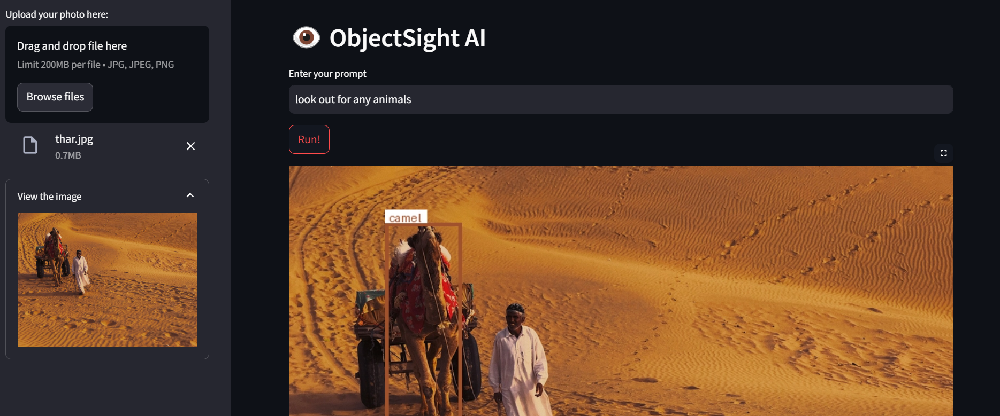

# ObjectSight AI 👁️
A powerful and intuitive image analysis interface powered by Google's Gemini Flash 2, built with Python and Streamlit.


## 🌟 Features
- 🎯 Real-time object detection and localization
- 📦 Clear bounding box visualization with enhanced labels
- 🔄 Support for common image formats (JPG, JPEG, PNG)
- 🎨 Clean and minimalist user interface
- 💾 Download capability for analyzed images
- 🔑 Secure API key management

## 🖼️ Snapshot


## 🔧 Prerequisites
- Python 3.12 or higher
- A Web Browser
- Google API key from [Google AI Studio](https://makersuite.google.com/app/apikey)

## 📥 Installation
1. Clone the repository:
```bash
git clone https://github.com/smaranjitghose/ObjectSightAI.git
cd ObjectSightAI
```

2. Create and activate virtual environment:
```bash
# Windows
python -m venv env
.\env\Scripts\activate

# Linux/Mac
python3 -m venv env
source env/bin/activate
```

3. Install required packages:
```bash
pip install -r requirements.txt
```

## 🚀 Usage
1. Start ObjectSight AI:
```bash
streamlit run app.py
```

2. Open your browser and navigate to:
```
http://localhost:8501
```

## 💡 Quick Start Guide
1. Enter your Google API key in the sidebar
2. Upload an image using the file uploader
3. Write a descriptive prompt about what to analyze
4. Click "Run!" to start the analysis
5. View results and download the analyzed image if desired

## 🎯 Example Prompts
```plaintext
"Identify and locate all objects in this image"
"Find and label all people and furniture"
"Detect all electronic devices"
"Locate and identify different types of vehicles"
```

## 🛠️ Troubleshooting
### Common Issues
1. **API Key Error**
   - Verify API key is entered correctly
   - Check if API key has necessary permissions
   - Ensure API key is active

2. **Image Upload Issues**
   - Check if image format is supported
   - Ensure image size is under limit
   - Verify image is not corrupted

3. **Analysis Failures**
   - Check internet connection
   - Verify API quota hasn't been exceeded
   - Ensure prompt is clear and specific

## 🤝 Contributing
Contributions are welcome! Please feel free to submit a Pull Request.
1. Fork the project
2. Create your feature branch (`git checkout -b feature/AmazingFeature`)
3. Commit your changes (`git commit -m 'Add some AmazingFeature'`)
4. Push to the branch (`git push origin feature/AmazingFeature`)
5. Open a Pull Request

## 📝 License
This project is licensed under the MIT License - see the [LICENSE](LICENSE) file for details.

---
Made with ❤️ by [Smaranjit Ghose](https://github.com/smaranjitghose)
